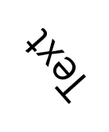
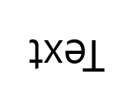
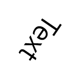
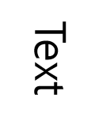

## DB 소개
한국어, 영어 OCR을 위한 대한 데이터셋입니다.

단어 단위로 구분되어 annotation 되어 있고, 각 instance 별로 Text Detection, Text Recognition을 위한 정보가 포함되어 있습니다.  

## DB 다운로드
* 다운로드 [링크](https://drive.google.com/file/d/1AYEpejAB5jd2zi-vWayCQmDkQN-kKrvN/view?usp=sharing) (압축버전)
* 다운로드 [링크](https://kor01.safelinks.protection.outlook.com/?url=https%3A%2F%2Fdrive.google.com%2Fdrive%2Ffolders%2F11frxzBLp-2_krbjVLSozXXurbmuh40A8%3Fusp%3Dsharing&data=04%7C01%7Cjaemyunglee%40ncsoft.com%7Cfa5107f91fa14d8976cf08d8b2e9ec9f%7C91856527a4464990b48e37ca10f2ee8d%7C0%7C0%7C637456065049643905%7CUnknown%7CTWFpbGZsb3d8eyJWIjoiMC4wLjAwMDAiLCJQIjoiV2luMzIiLCJBTiI6Ik1haWwiLCJXVCI6Mn0%3D%7C1000&sdata=9hP6MzZwdKSPD0Tk34N2cr3jELakiIYbhhaIiH7bzNw%3D&reserved=0) (미리보기 가능)

## DB 구성
해당 DB는 3000장의 이미지 파일과 1개의 json 파일로 구성되어 있습니다.
* 이미지
    * 이미지(1920x1080)는 총 3000장이며, 고유한 파일이름을 갖습니다.
* Annotation
    * 1개의 json 파일에 3000장의 annotation 정보가 저장되어 있습니다.
    * 이미지 별로 아래와 같이 속성이 정의가 되어있습니다.
        * "id": 이미지 고유 id
        * "name": 이미지 파일명
        * "Objects": 이미지의 instance 별 annotation 정보. "Objects"에는 각 instanse 별로 아래와 같이 정의가 되어있습니다.
        
            | **속성** | **속성값** | **info** |
            |  :---:  |  :---:  |  :---:  | 
            | "id" | 해당 이미지에서의 instance id | 5 digit number |
            | "class" | class 이름  | "sign" |
            | "points" | Polygon 좌표 | [x1, y1, x2, y2, ... , xn, yn] |
            | "Description" | instance의 글자 정보 | 유니코드 |
            | "Reading Direction" | 글자 진행 방향 | Horizontal / Vertical |
            | "Text Direction Index" | 글자 진행 방향 | 0 ~ 7 |
            | "Art Character" | 타이포그래피 여부 | true / false |
            | "Special Characters" | 특수문자 여부 | true / false |
            | "occlusion" | 가려진 글자인지에 대한 정보 | true / false |
            | "Don't care" | Don't care | true / false |
    * ```json
      {
          "image": [
              {
                  "id": "00000",
                  "name": "0518_S00003.jpg",
                  "objects": [
                      {
                          "id": "00000",
                          "class": "sign",
                          "points": [
                              "1873.10",
                              "230.58",
                              "1893.46",
                              "229.17",
                              "1900.01",
                              "232.35",
                              "1898.59",
                              "242.44",
                              "1893.46",
                              "247.93",
                              "1869.74",
                              "250.23"
                          ],
                          "Description": "H",
                          "Reading Direction": "Horizontal",
                          "Text Direction Index": "0",
                          "Art Characters": "false",
                          "Special Characters": "false",
                          "occlusion": "true",
                          "Don't Care": "false"
                      },
                      {
                          "id": "00001",
                          "class": "...",
                          ...
                      }
                  ]
              },
              {
                  ...
              },
              ...
          ]
      }
      ```
## Annotation 상세 사항
* Text Direction Index
    * 글자 각도 인덱스 = {0, 1, 2, ..., 7}
    
    | **N=0** | **N=1** | **N=2** | **N=3** | **N=4** | **N=5** | **N=6** | **N=7** |
    |  :---:  |  :---:  |  :---:  |  :---:  |  :---:  |  :---:  |  :---:  |  :---:  |
    | <p align="center">  </p> | <p align="center">  </p> | <p align="center">  </p> | <p align="center">  </p> | <p align="center">  </p> | <p align="center">  </p> | <p align="center">  </p> | <p align="center">  </p> |
    
## 

